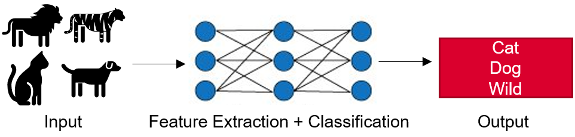
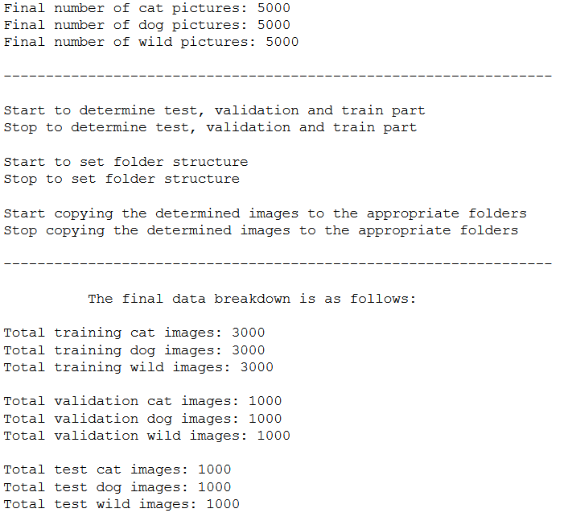
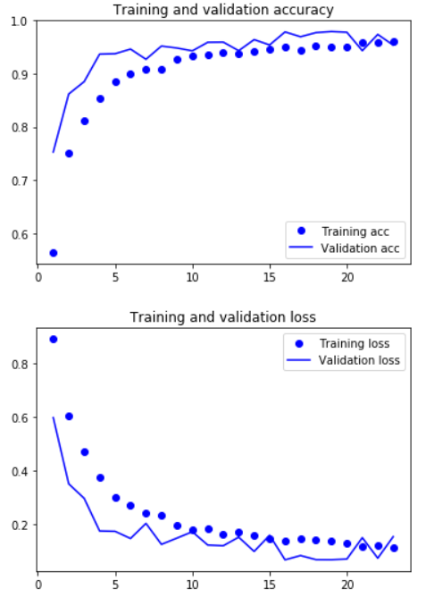
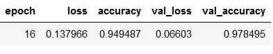
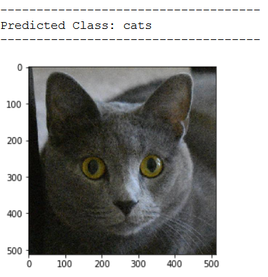
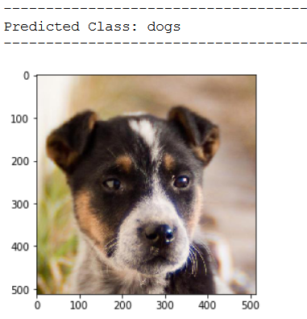
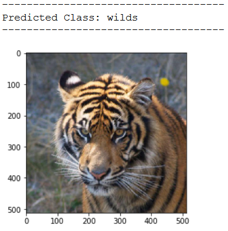

# Computer Vision: CNN for Multi-Label Classification



The goal of this project is to use a convolutional neural network (CNN) to determine cats, dogs and predatory cats pictures. 
How I proceeded exactly and what results I achieved can be read in my blog post: [Computer Vision - CNN for Multi-Label Classification](https://michael-fuchs-python.netlify.app/2021/01/15/computer-vision-cnn-for-multi-label-classification/)


## Table of Contents
1. [Introduction](#introduction)
2. [Software Requirements](#software_requirements)
3. [Getting Started](#getting_started)
4. [Folder Structure](#folder_structure)
5. [Running the Jupyter Notebook](#running_jpynb)
    1. [Execution of the preprocessing_multi_CNN.py file](#running_preprocessing)
    2. [Classify Cat, Dog and Wild Images](#classify_cat_dog_wild_images)
6. [Project Results](#project_results)
7. [Link to the Publication](#links)   
8. [Authors](#authors)
9. [Project Motivation](#motivation)
10. [References](#references)


<a name="introduction"></a>

## Introduction

For this repository I wrote a preprocessing_multi_CNN.py file which automatically randomizes the provided image data and divides it into a training, validation and test part. 
This is followed by model training using a CNN. 
The storage of the best model as well as the safeguarding of all important metrics during the model training is also fully automatic. 
This is a best practice guideline on how to create a Multi-Label image classifier and bring it to production. 


<a name="software_requirements"></a>

## Software Requirements

Required libraries:

+ Python 3.x
+ Scikit-Learn
+ Keras
+ TensorFlow
+ Numpy
+ Pandas
+ Matplotlib
+ OpenCV

Please run ```pip install -r requirements.txt```


<a name="getting_started"></a>

## Getting Started

1. Make sure Python 3 is installed.
2. Clone the repository and navigate to the project's root directory in the terminal
3. Download the [cats dataset](https://github.com/MFuchs1989/Datasets-and-Miscellaneous/tree/main/datasets/Computer%20Vision/CNN%20for%20Multi%20Label%20Classification/cats). Unzip the folder and place the images in the cloned repository in the folder ```cats```. If the folder does not exist yet, please create one. 
4. Download the [dogs dataset](https://github.com/MFuchs1989/Datasets-and-Miscellaneous/tree/main/datasets/Computer%20Vision/CNN%20for%20Multi%20Label%20Classification/dogs). Unzip the folder and place the images in the cloned repository in the folder ```dogs```. If the folder does not exist yet, please create one. 
5. Download the [wilds dataset](https://github.com/MFuchs1989/Datasets-and-Miscellaneous/tree/main/datasets/Computer%20Vision/CNN%20for%20Multi%20Label%20Classification/wilds). Unzip the folder and place the images in the cloned repository in the folder ```wilds```. If the folder does not exist yet, please create one. 
6. Start the notebook ```CV - CNN for Multi-Label Classification.ipynb```.


<a name="folder_structure"></a>

## Folder Structure

The current folder structure should look like this:

```
C:.
│   CV - Multi CNN.ipynb
│   preprocessing_multi_CNN.py
│
├───cats
├───dogs
├───test_pictures
└───wilds
```


<a name="running_jpynb"></a>

## Running the Jupyter Notebook


<a name="running_preprocessing"></a>

### Execution of the preprocessing_multi_CNN.py file

Import all necessary libraries and execute the train-validation-test-split function.

Here is the output of the function:




<a name="classify_cat_dog_wild_images"></a>

### Classify Cat, Dog and Wild Images

Execute all remaining lines of code in the notebook.


**Model Evaluation**




**Final Folder Structure**

The final folder structure should now look like this:

```
C:.
│   CV - Multi CNN.ipynb
│   preprocessing_multi_CNN.py
│
├───animals
│   ├───test
│   │   ├───cats
│   │   ├───dogs
│   │   └───wilds
│   ├───train
│   │   ├───cats
│   │   ├───dogs
│   │   └───wilds
│   └───validation
│       ├───cats
│       ├───dogs
│       └───wilds
├───cats
├───ckpt_1_CNN_with_augm
│       Animals_CNN_4_Conv_F32_64_128_128_epoch_60_es.h5
│       class_assignment_df_Animals_CNN_4_Conv_F32_64_128_128_epoch_60_es.csv
│       history_df_Animals_CNN_4_Conv_F32_64_128_128_epoch_60_es.csv
│
├───dogs
├───test_pictures
└───wilds
```


<a name="project_results"></a>

## Project Results

The best model achieved a validation accuracy of over 97%.




Here are a few more test predictions:









<a name="links"></a>

## Link to the Publication

Here is the link to my blog post: [Computer Vision - CNN for Multi-Label Classification](https://michael-fuchs-python.netlify.app/2021/01/15/computer-vision-cnn-for-multi-label-classification/).

If this repository/publication helped you, you are welcome to read other blog posts I wrote on the topic of Computer Vision:

+ [Classification of Dog-Breeds using a pre-trained CNN model](https://michael-fuchs-python.netlify.app/2021/01/27/classification-of-dog-breeds-using-a-pre-trained-cnn-model/)
+ [Convolutional Neural Network](https://michael-fuchs-python.netlify.app/2021/01/08/computer-vision-convolutional-neural-network/)
+ [Automate The Boring Stuff](https://michael-fuchs-python.netlify.app/2021/01/01/computer-vision-automate-the-boring-stuff/)


<a name="authors"></a>

## Authors

+ [Michael Fuchs](https://github.com/MFuchs1989)

<a name="motivation"></a>

## Project Motivation: 

I've been blogging since 2018 on my homepages about all sorts of topics related to Machine Learning, Data Analytics, Data Science and much more.
You are welcome to visit them:

+ [Python Blog](https://michael-fuchs-python.netlify.app/)
+ [R Blog](https://michael-fuchs.netlify.app/)

I also publish individual interesting sections from my publications in separate repositories to make their access even easier. 


<a name="references"></a>

## References

Chollet, F. (2018). Deep learning with Python (Vol. 361). New York: Manning.
